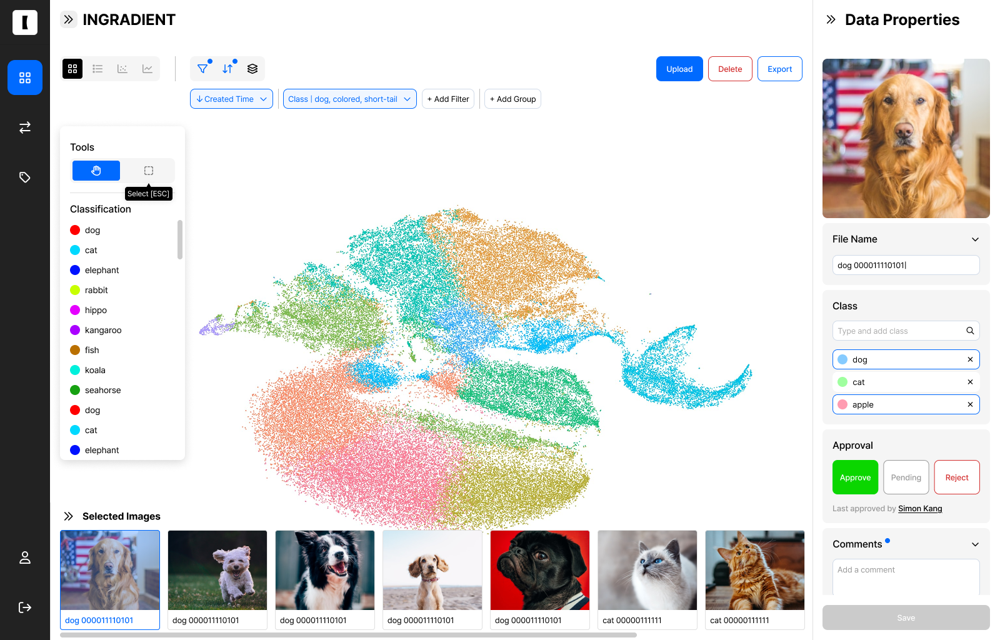

# Ingradient



Ingradient is an open-source labeling and dataset management tool designed to provide an intuitive interface for dataset creation, annotation, and organization.

## 🚀 Features

- **Dataset Management**: Create, edit, and delete datasets.
- **Image Upload & Management**: Upload images and organize them into datasets.
- **Annotation Support**:
  - **Classification**
  - **Keypoints**
  - **Bounding Boxes**
- **Python SDK**: Interact with the system programmatically.
- **Web UI**: A user-friendly frontend.

---

## 📦 Installation

It is **highly recommended** to create a Python virtual environment before installing Ingradient.

### Create and Activate a Virtual Environment

#### On macOS / Ubuntu (Linux)

```bash
# Create a virtual environment named "env"
python3 -m venv env

# Activate the virtual environment
source env/bin/activate
```

#### On Windows

**Using Command Prompt:**

```cmd
python -m venv env
env\Scripts\activate
```

**Using PowerShell:**

```powershell
python -m venv env
.\env\Scripts\Activate.ps1
```

> **Note:** If you encounter an execution policy error in PowerShell, run:
> ```powershell
> Set-ExecutionPolicy -ExecutionPolicy RemoteSigned -Scope CurrentUser
> ```
> and then try activating again.

Once the virtual environment is activated, install Ingradient via pip:

```bash
pip install ingradient
```

Alternatively, for local development:

```bash
# 1. Navigate to the frontend directory
cd web

# 2. Install dependencies (first time only)
npm install

# 3. Build the frontend
npm run build

# 4. Go back to the root and install the Python package in editable mode
cd ..
pip install -e .
```
> ⚠️ **Why?**  
> Ingradient's frontend is built using Next.js and exported as a static site. The `npm run build` command generates these static files and places them inside `ingradient_sdk/static`, which the Python backend serves.  
> Without this step, the UI will not be accessible from the browser.

---

## 🏃 Usage

### Run Ingradient

Once installed, simply run:

```bash
ingradient
```

This single command will start:
1. A **FastAPI backend** at `http://127.0.0.1:8000`
2. A **Next.js frontend** served as a static website

---

## 💻 Python SDK Usage Example

Below is an example of how to interact with Ingradient programmatically using the Python SDK:

```python
from ingradient_sdk import Ingradient

# 1. Initialize Ingradient client: Set server URL
ing = Ingradient(url="http://localhost:8000")
print("Client connection established!")

# 2. Dataset management
# 2-1) Retrieve the list of existing datasets
dataset_list = ing.dataset.get_list()
print("Current dataset list:", dataset_list)

# 2-2) Create new datasets
new_dataset = ing.dataset.create(name="MyNewDataset")
print("Created dataset:", new_dataset)

# 3. Image management
# 3-1) Upload a single image
single_image_upload = ing.image.upload(
    dataset_id=new_dataset.id,    
    file_path="path/to/image1.jpg"
)
print("Single image upload completed:", single_image_upload)

# 3-2) Retrieve image list (now includes class information)
image_list = ing.image.get_list(dataset_id=new_dataset.id)
print(f"Image list in dataset (ID: {new_dataset.id}):", image_list)

# 3-3) Assign class to an image and update on server
if len(image_list) > 0:
    some_image = image_list[0]  # 이미지 리스트에서 첫 번째 이미지 선택
    class_list = ing.classes.get_list(dataset_id=new_dataset.id)  # 해당 데이터셋의 클래스 목록 가져오기

    if len(class_list) > 0:
        some_class_id = class_list[0]['id']  # 첫 번째 클래스를 선택
        some_image.classes = some_class_id   # 이미지에 클래스 ID 할당
        some_image.save()  # 서버에 업데이트 요청
        print(f"Image (ID: {some_image['id']}) assigned to class (ID: {some_class_id}) and updated on server.")

# 3-4) Assign multiple classes to an image and update on server
if len(image_list) > 0 and len(class_list) > 1:
    some_image = image_list[0]  # 같은 이미지 대상으로
    multiple_class_ids = [class_list[0]['id'], class_list[1]['id']]  # 첫 번째, 두 번째 클래스 추가
    some_image.classes = multiple_class_ids  # 여러 개의 클래스 ID 할당
    some_image.save()  # 서버에 업데이트 요청
    print(f"Image (ID: {some_image['id']}) assigned to classes: {multiple_class_ids} and updated on server.")

# 3-5) Delete an image
if len(image_list) > 0:
    ing.image.delete(dataset_id=new_dataset.id, image_id=some_image['id'])
    print(f"Image (ID: {some_image['id']}) deleted successfully")

# 4. Class (Label) management
# 4-1) Retrieve the list of existing classes (all datasets)
all_classes = ing.classes.get_list()
print("All classes:", all_classes)

# 4-2) Retrieve classes only for a specific dataset
dataset_classes = ing.classes.get_list(dataset_id=new_dataset.id)
print(f"Classes in dataset (ID: {new_dataset.id}):", dataset_classes)

# 4-3) Create a new class (now requires a dataset_id)
new_class = ing.classes.create(name="NewLabel", dataset_id=new_dataset.id)
print(f"Created class in dataset (ID: {new_dataset.id}):", new_class)

# 4-4) Update class name
if len(dataset_classes) > 0:
    target_class_id = dataset_classes[0]['id']
    updated_class = ing.classes.update(class_id=target_class_id, new_name="UpdatedClassName")
    print(f"Class (ID: {target_class_id}) name updated:", updated_class)

# 4-5) Delete a class
if len(dataset_classes) > 1:
    another_class_id = dataset_classes[1]['id']
    ing.classes.delete(class_id=another_class_id)
    print(f"Class (ID: {another_class_id}) deleted successfully")

# 5. Delete the created dataset
ing.dataset.delete(dataset_id=new_dataset.id)
print(f"Dataset (ID: {new_dataset.id}) deleted successfully")
```

---

## 🔌 API Endpoints

### Datasets
- `GET /api/datasets` - List all datasets
- `POST /api/datasets` - Create a new dataset
- `PUT /api/datasets/{id}` - Update a dataset name
- `DELETE /api/datasets/{id}` - Delete a dataset

### Images
- `POST /api/images/{dataset_id}` - Upload an image
- `GET /api/images/{image_id}` - Get image details
- `DELETE /api/images/{image_id}` - Delete an image

### Labels
- `POST /api/labels/{image_id}` - Add annotation (classification, keypoints, bounding box)
- `GET /api/labels/{image_id}` - Get annotations

For more details, visit `http://127.0.0.1:8000/docs` for interactive API documentation (Swagger UI).

---

## 🐳 Docker Deployment

You can also run Ingradient using Docker:

```bash
docker build -t ingradient .
docker run -p 8000:8000 ingradient
```

This will start both the backend and frontend in a containerized environment.

---

## 📝 Contributing

Contributions are welcome! For guidelines on contributing, please see our [CONTRIBUTING.md](CONTRIBUTING.md) file.

---

## 📄 License

This project is licensed under the MIT License - see the [LICENSE](LICENSE) file for details.

---

## 📬 Contact

For any inquiries, feel free to open an issue or reach out:

- **Email:** june@ingradient.ai
- **GitHub:** [JUNE](https://github.com/junhoning)

Happy coding! 🚀
